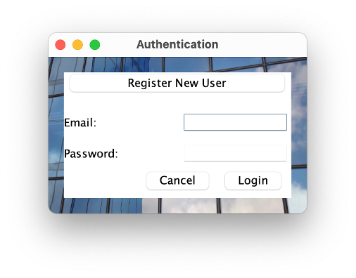
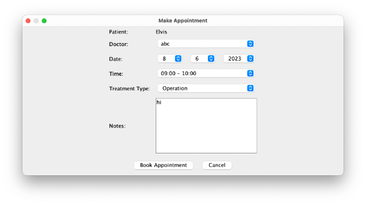
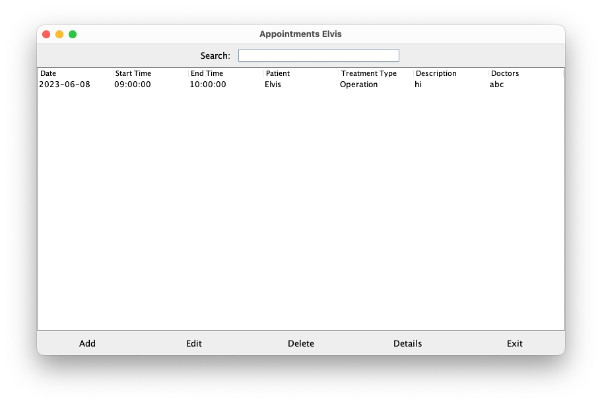
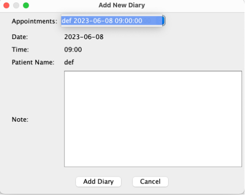
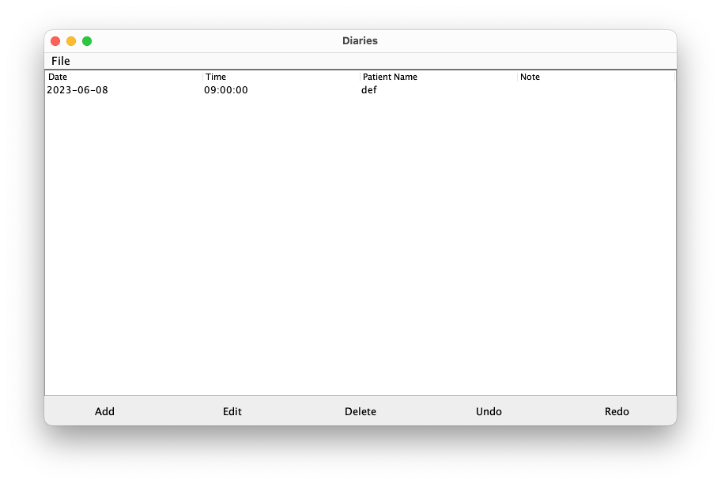

# Operation Scheduler

This project aims to create a scheduler of operations in the hospital, which will help the medical staff to effectively manage patient appointments, and patients will be able to make appointments independently through their personal online office. 

## Features

- Making and managing records for health professionals.
- Keeping electronic diaries for each professional.
- Finding, and scheduling patient visits, and offering the ability to undo them.

## Usage
Require JDK version 17 or higher.  
Run the following command or the Main method in gui folder.
```
java -jar Operation_Scheduler_Group3.jar
```


## Screenshots
<p align ="center">
    
    
    
    
    
    
</p>